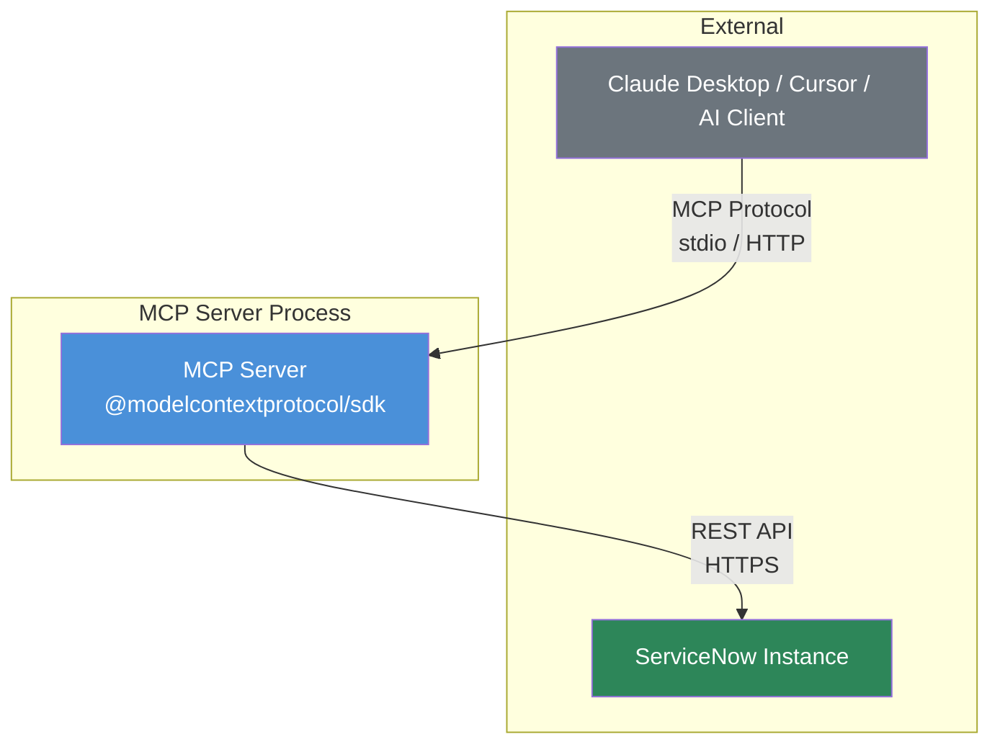
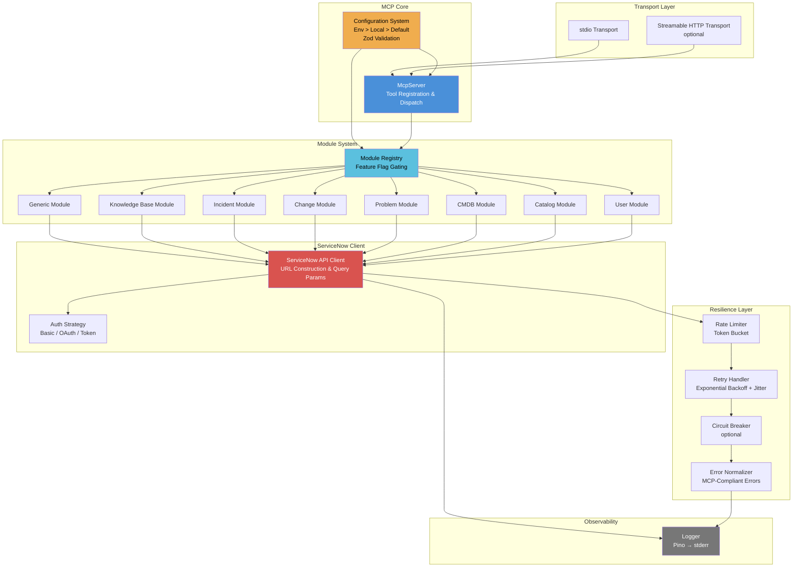
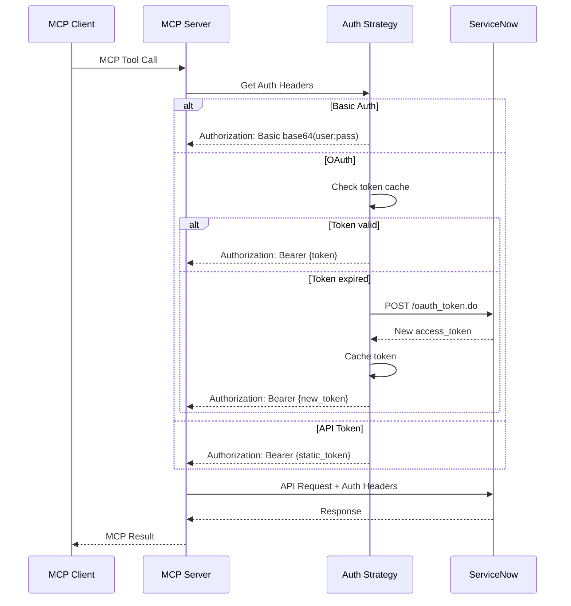

# Engineering Blueprint

## Meta

| Field | Value |
|-------|-------|
| Version | 1.0.0 |
| Phase | 2 |
| Domain | Cloud / API Integration |
| Architecture Pattern | Modular Monolith (Plugin Architecture) |
| Author Role | Software Architect |
| Created | 2026-02-11 |
| Status | Approved |

---

## Architecture Overview

The ServiceNow MCP Bridge is a **modular monolith** server that translates Model Context Protocol (MCP) requests into ServiceNow REST API calls. It uses a **plugin architecture** where each ServiceNow domain (Incident, Knowledge, CMDB, etc.) is an independently-enableable module that registers MCP tools at startup based on feature flags.

### Principles

- **KISS**: Single-process server; no microservices, no message queues, no caches
- **DRY**: Shared ServiceNow client, shared error handling, shared response formatting
- **SOLID**: Each module has a single responsibility; module interface enforces consistent structure
- **Fail-Fast**: Invalid configuration rejected at startup via Zod validation
- **Defense-in-Depth**: Input validation → auth → rate limiting → retry → error normalization

### Key Design Decisions

1. **Modular Monolith over Microservices** — Single MCP server process; modules are code-level boundaries, not service boundaries. Simplicity over scalability for v0.1.0.
2. **Plugin Registry Pattern** — Modules register themselves via a standard interface. Adding a module = 1 new directory + 1 registry entry.
3. **Layered Resilience** — Rate limiter (pre-request) → ServiceNow client (HTTP) → Retry with backoff → Circuit breaker (optional) → Error normalization (post-request).
4. **Write Controls as First-Class** — Per-module `allow_write` flags control tool registration at startup, not runtime authorization checks. If writes are disabled, write tools simply don't exist.

---

## System Context Diagram



---

## Component Diagram



---

## Component Descriptions

### 1. MCP Server (`src/server.ts`)

- **Responsibility**: Initialize MCP server, wire transport, delegate tool registration to module registry
- **Technology**: `@modelcontextprotocol/sdk` McpServer
- **Interfaces**: MCP protocol (stdio or HTTP)
- **Dependencies**: Config, Module Registry

### 2. Configuration System (`src/config/`)

- **Responsibility**: Load and validate configuration with 3-tier precedence (env > local file > defaults)
- **Technology**: Zod schemas for validation, `dotenv` for env loading
- **Interfaces**: Typed config object consumed by all components
- **Key Design**: Fail-fast on invalid config — server does not start with partial configuration

**Configuration Schema (conceptual)**:
```
{
  servicenow: { instance, timeout, max_retries },
  auth: { type: "basic" | "oauth" | "token", credentials... },
  modules: {
    generic: { enabled, allow_write },
    knowledge: { enabled, allow_write },
    incident: { enabled, allow_write },
    change: { enabled, allow_write },
    problem: { enabled, allow_write },
    cmdb: { enabled, allow_write },
    catalog: { enabled, allow_write },
    user: { enabled }
  },
  rate_limit: { max_per_hour, burst_size },
  circuit_breaker: { enabled, threshold, reset_timeout },
  logging: { level }
}
```

### 3. Module Registry (`src/modules/registry.ts`)

- **Responsibility**: Read feature flags, instantiate enabled modules, register their tools with MCP server
- **Technology**: TypeScript module interface
- **Interfaces**: `ServiceNowModule` interface with `config` metadata and `register(server, client)` method
- **Key Design**: Adding a module = create module directory + add to ALL_MODULES array

**Module Interface**:
```typescript
interface ServiceNowModule {
  name: string;
  description: string;
  register(server: McpServer, client: ServiceNowClient, config: ModuleConfig): void;
}
```

### 4. Domain Modules (`src/modules/{name}/`)

Each module follows an identical structure:
- `index.ts` — Module metadata and `register()` function
- `tools.ts` — Tool definitions with Zod schemas and handlers
- `types.ts` — Module-specific TypeScript types

**Tool Registration Pattern**:
- Read-only tools (list, get, search) always registered when module is enabled
- Write tools (create, update, delete) only registered when `allow_write: true`

**Module Priority Order** (implementation sequence):
1. Generic (foundation — validates client works)
2. Knowledge Base (user priority #1)
3. Incident (most common use case)
4. Change, Problem, CMDB, Catalog, User (remaining modules)

### 5. ServiceNow API Client (`src/client/`)

- **Responsibility**: Construct URLs, serialize query params, execute HTTP requests, handle auth
- **Technology**: Node.js native `fetch` API (Node ≥20)
- **Interfaces**: `ServiceNowClient` class with `get()`, `post()`, `patch()`, `delete()` methods
- **Key Design**: All HTTP calls go through resilience layer

**URL Construction**:
- Table API: `https://{instance}.service-now.com/api/now/table/{table}`
- Aggregate API: `https://{instance}.service-now.com/api/now/stats/{table}`

**Query Parameters**:
- `sysparm_query`, `sysparm_limit`, `sysparm_offset`
- `sysparm_fields`, `sysparm_display_value`, `sysparm_order_by`

### 6. Authentication Strategies (`src/auth/`)

- **Responsibility**: Provide auth headers for ServiceNow API requests
- **Technology**: Strategy pattern — pluggable auth providers
- **Strategies**:
  - `BasicAuthStrategy` — Base64 username:password header
  - `OAuthStrategy` — Client Credentials grant with token caching and auto-refresh
  - `TokenAuthStrategy` — Static bearer token

### 7. Resilience Layer (`src/resilience/`)

- **Rate Limiter** (`rate-limiter.ts`): Token bucket algorithm, configurable max/hour and burst
- **Retry Handler** (`retry.ts`): Exponential backoff with jitter, retryable error detection (429, 503, network)
- **Circuit Breaker** (`circuit-breaker.ts`): CLOSED → OPEN → HALF_OPEN states, config-gated
- **Error Normalizer** (`errors.ts`): Maps HTTP errors to MCP-compliant `CallToolResult` with `isError: true`

**Error Code Mapping**:
| HTTP Status | MCP Error Code | Description |
|------------|----------------|-------------|
| 400 | `VALIDATION_ERROR` | Bad request / invalid query |
| 401 | `AUTHENTICATION_ERROR` | Invalid credentials |
| 403 | `AUTHORIZATION_ERROR` | Insufficient ACL permissions |
| 404 | `NOT_FOUND` | Record or table not found |
| 429 | `RATE_LIMITED` | API quota exceeded |
| 500+ | `SERVER_ERROR` | ServiceNow server error |
| Network | `NETWORK_ERROR` | Connection refused, timeout, DNS |
| Circuit Open | `CIRCUIT_OPEN` | Circuit breaker is open |

### 8. Logging (`src/logging/`)

- **Responsibility**: Structured JSON logging for all operations
- **Technology**: Pino v9.x → stderr (stdout reserved for MCP protocol)
- **Key Features**:
  - Child loggers per request with correlation ID
  - Automatic API call logging (method, table, duration_ms, status_code)
  - Log levels: trace, debug, info, warn, error, fatal

---

## Architectural Decisions

### ADR-001: Modular Monolith over Microservices

**Status**: Accepted

**Context**: Need to support 8+ ServiceNow modules with independent enablement.

**Decision**: Single-process monolith with plugin-based module system.

**Rationale**:
- MCP servers are typically single-process (spawned by client)
- No inter-service communication overhead
- Simpler deployment (single binary / npm package)
- Module boundaries enforced by TypeScript interfaces, not network

**Competitive Context**:
- echelon-ai-labs: Monolith with no module system
- LokiMCPUniverse: Separate servers per module (fragmented)
- Our differentiator: Monolith with clean plugin architecture — best of both worlds

### ADR-002: Native fetch over axios/node-fetch

**Status**: Accepted

**Context**: Need HTTP client for ServiceNow API calls.

**Decision**: Use Node.js built-in `fetch` API (available since Node 18, stable in Node 20+).

**Rationale**:
- Zero additional dependencies
- Standard web API (familiar to developers)
- TC-001 requires Node ≥20, which has stable `fetch`
- Reduces supply chain risk

**Alternatives Rejected**:
- axios: Additional dependency, larger bundle, unnecessary features
- node-fetch: Polyfill for built-in — no longer needed on Node 20+

### ADR-003: Strategy Pattern for Authentication

**Status**: Accepted

**Context**: Need to support 3 auth methods (Basic, OAuth, Token) with different lifecycle patterns.

**Decision**: Strategy pattern with `AuthStrategy` interface and per-method implementations.

**Rationale**:
- Clean separation — each strategy handles its own complexity
- OAuth token lifecycle (caching, refresh) isolated from client code
- New strategies addable without modifying client

### ADR-004: Tool Registration at Startup (Not Runtime Authorization)

**Status**: Accepted

**Context**: Need to control write operations per module.

**Decision**: Write tools are conditionally registered at startup based on `allow_write` config flags. If `allow_write=false`, write tools are never registered — they don't exist in the MCP tool list.

**Rationale**:
- Simpler than runtime authorization checks
- AI clients can't invoke tools that don't exist
- Configuration is declarative and auditable
- No risk of authorization bypass

**Competitive Context**:
- No competitor implements per-module write controls
- Our differentiator: Granular, config-driven write control with zero runtime overhead

### ADR-005: Pino over Winston/Bunyan for Logging

**Status**: Accepted

**Context**: Need structured JSON logging to stderr.

**Decision**: Pino v9.x with stderr destination.

**Rationale**:
- Fastest Node.js JSON logger (benchmarked)
- Native JSON output (no formatting overhead)
- Child loggers for correlation IDs
- Simple destination configuration for stderr
- Active maintenance, high npm download count

### ADR-006: MCP SDK v1.x API (server.tool)

**Status**: Accepted

**Context**: MCP SDK has v1 (`server.tool()`) and v2 (`server.registerTool()`) APIs.

**Decision**: Use v1 `server.tool()` API with Zod v3 schemas.

**Rationale**:
- Spec requires MCP SDK v1.x and Zod v3.x
- v1 API is simpler and widely documented
- v2 migration path documented and straightforward when needed
- Zod v3 `.describe()` works for AI tool discoverability

**Review Trigger**: Revisit when MCP SDK v2 becomes the minimum supported version.

---

## Security Architecture

### Authentication Flow



### Security Controls

| Control | Implementation | FR/NFR |
|---------|---------------|--------|
| Credential Protection | Environment variables only; never in source | NFR-004, RC-001 |
| Input Validation | Zod schemas on all tool inputs | NFR-005 |
| Table Name Sanitization | Allowlist or regex validation | NFR-005 |
| sys_id Sanitization | 32-char hex validation | NFR-005 |
| Write Control | Per-module `allow_write` flags | FR-026, NFR-009 |
| Error Sanitization | No internal details leaked in MCP errors | FR-025 |
| Rate Limiting | Token bucket prevents API abuse | FR-023 |
| Log Sanitization | Credentials never logged; PII redaction | NFR-007 |

---

## Data Architecture

### Data Flow

```
MCP Client Request
    → MCP Server (parse + validate input via Zod)
    → Module Handler (build ServiceNow query)
    → ServiceNow Client (construct URL + params)
    → Resilience Layer (rate limit → retry → circuit breaker)
    → ServiceNow REST API (HTTP request)
    → Response Processing (extract result array)
    → Error Normalization (if error)
    → MCP Response (CallToolResult)
    → MCP Client
```

### Data Transformations

1. **Input**: MCP tool parameters → ServiceNow query parameters (sysparm_*)
2. **Output**: ServiceNow JSON response → MCP CallToolResult with structured content
3. **Errors**: HTTP error codes → MCP-compliant error objects with `isError: true`

### No Persistent State

The server is **stateless** between requests:
- No database, no cache (except OAuth token in-memory)
- No session state for MCP clients
- All data flows through to ServiceNow and back

---

## Domain-Specific Patterns (Cloud / API Integration)

### Applied Patterns

1. **12-Factor App Principles**:
   - Config via environment variables (Factor III)
   - Logs as event streams to stderr (Factor XI)
   - Stateless processes (Factor VI)
   - Port binding for HTTP transport (Factor VII)

2. **Service-Oriented Design**:
   - Clean interface between MCP layer and ServiceNow client
   - Each module encapsulates domain logic
   - Standardized module interface for extensibility

3. **Resilience Patterns**:
   - Retry with exponential backoff + jitter
   - Circuit breaker for sustained failures
   - Token bucket rate limiting
   - Bulkhead: per-module isolation

4. **API Gateway Patterns** (applied to single server):
   - Request validation at entry point
   - Rate limiting before upstream calls
   - Error normalization for consistent client experience
   - Structured logging with correlation IDs

---

## Directory Structure

```
servicenow-mcp-bridge/
├── src/
│   ├── index.ts                    # Entry point
│   ├── server.ts                   # MCP server setup + transport
│   ├── config/
│   │   ├── index.ts                # Config loader (env > file > defaults)
│   │   ├── schema.ts               # Zod configuration schema
│   │   └── defaults.ts             # Default configuration values
│   ├── auth/
│   │   ├── index.ts                # Auth strategy factory
│   │   ├── types.ts                # AuthStrategy interface
│   │   ├── basic.ts                # Basic Auth strategy
│   │   ├── oauth.ts                # OAuth 2.0 Client Credentials
│   │   └── token.ts                # Static Bearer Token
│   ├── client/
│   │   ├── index.ts                # ServiceNowClient class
│   │   ├── types.ts                # Client types (request/response)
│   │   └── query-builder.ts        # Query parameter serialization
│   ├── resilience/
│   │   ├── rate-limiter.ts         # Token bucket rate limiter
│   │   ├── retry.ts                # Exponential backoff retry
│   │   ├── circuit-breaker.ts      # Circuit breaker (optional)
│   │   └── index.ts                # Resilience pipeline composition
│   ├── errors/
│   │   ├── index.ts                # Error normalizer
│   │   ├── types.ts                # Error code enum + types
│   │   └── mcp-error.ts            # MCP CallToolResult error builder
│   ├── logging/
│   │   └── index.ts                # Pino logger setup (stderr)
│   └── modules/
│       ├── registry.ts             # Module registry + feature flag gating
│       ├── types.ts                # ServiceNowModule interface
│       ├── generic/
│       │   ├── index.ts            # Module metadata + register()
│       │   ├── tools.ts            # Tool definitions
│       │   └── types.ts            # Module types
│       ├── knowledge/
│       │   ├── index.ts
│       │   ├── tools.ts
│       │   └── types.ts
│       ├── incident/
│       │   ├── index.ts
│       │   ├── tools.ts
│       │   └── types.ts
│       ├── change/
│       │   ├── index.ts
│       │   ├── tools.ts
│       │   └── types.ts
│       ├── problem/
│       │   ├── index.ts
│       │   ├── tools.ts
│       │   └── types.ts
│       ├── cmdb/
│       │   ├── index.ts
│       │   ├── tools.ts
│       │   └── types.ts
│       ├── catalog/
│       │   ├── index.ts
│       │   ├── tools.ts
│       │   └── types.ts
│       └── user/
│           ├── index.ts
│           ├── tools.ts
│           └── types.ts
├── tests/
│   ├── unit/
│   │   ├── config/
│   │   ├── auth/
│   │   ├── client/
│   │   ├── resilience/
│   │   ├── errors/
│   │   └── modules/
│   └── integration/
│       ├── server.test.ts
│       ├── modules/
│       └── helpers/
│           └── mock-servicenow.ts
├── package.json
├── tsconfig.json
├── vitest.config.ts
├── .env.example
└── README.md
```

---

## Scalability Design

### v0.1.0 Scope

- **Single process**: One MCP server → one ServiceNow instance
- **Vertical scaling only**: Memory and CPU on host machine
- **Concurrency**: MCP protocol handles request serialization; server processes one tool call at a time
- **Rate limiting**: Prevents overwhelming ServiceNow API

### Future Scaling (v0.2.0+)

- Multi-instance support (one server → multiple ServiceNow instances)
- Connection pooling for HTTP transport
- Horizontal scaling via multiple server instances behind load balancer (HTTP transport only)

---

## Integration Points

| Integration | Protocol | Direction | Authentication |
|------------|----------|-----------|----------------|
| MCP Clients | MCP over stdio | Bidirectional | N/A (local process) |
| MCP Clients | MCP over HTTP | Bidirectional | Session-based |
| ServiceNow Table API | HTTPS REST | Outbound | Basic/OAuth/Token |
| ServiceNow Aggregate API | HTTPS REST | Outbound | Basic/OAuth/Token |
| ServiceNow OAuth Endpoint | HTTPS | Outbound | Client credentials |
