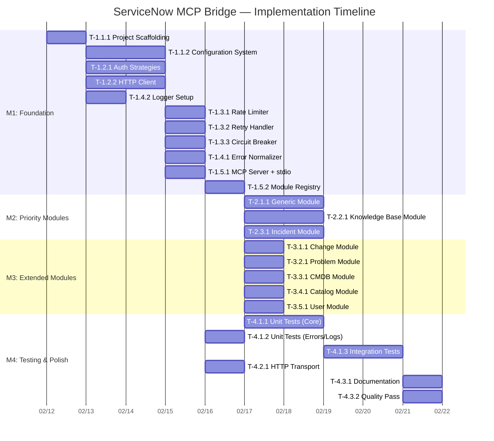

# Project Gantt Timeline

## Meta

| Field | Value |
|-------|-------|
| Version | 1.0 |
| Total Duration | ~80 hours (sequential) / ~35 hours (with parallelization) |
| Milestones | 4 |
| Created | 2026-02-11 |

---

## Visual Timeline



---

## Milestone Schedule

| Milestone | Start | End | Duration | Tasks |
|-----------|-------|-----|----------|-------|
| M1: Foundation | Day 1 | Day 7 | 7 days | 11 tasks |
| M2: Priority Modules | Day 8 | Day 9 | 2 days | 3 tasks (parallel) |
| M3: Extended Modules | Day 8 | Day 9 | 2 days | 5 tasks (parallel, concurrent with M2) |
| M4: Testing & Polish | Day 8 | Day 12 | 5 days | 6 tasks |

**Note:** M2 and M3 can run in parallel since all modules depend on the same foundation (T-1.5.2 + T-1.4.1). M4 testing starts as soon as core is complete and finishes after priority modules.

---

## Parallel Execution Windows

```
Day 1:    [T-1.1.1 Scaffolding]
Day 2-3:  [T-1.1.2 Config] [T-1.2.1 Auth] [T-1.2.2 Client] [T-1.4.2 Logger]
Day 4:    [T-1.3.1 Rate] [T-1.3.2 Retry] [T-1.3.3 CB] [T-1.4.1 Errors]
Day 5:    [T-1.5.1 MCP Server]
Day 6:    [T-1.5.2 Module Registry]
Day 7-8:  [T-2.1.1 Generic] [T-2.2.1 KB] [T-2.3.1 Incident] [T-3.x.x All Extended]
Day 8-9:  [T-4.1.1 Unit Tests] [T-4.1.2 Err Tests] [T-4.2.1 HTTP]
Day 10:   [T-4.1.3 Integration Tests]
Day 11:   [T-4.3.1 Docs] [T-4.3.2 Quality]
```

**Effective Duration with Parallelization: ~11 working days**
