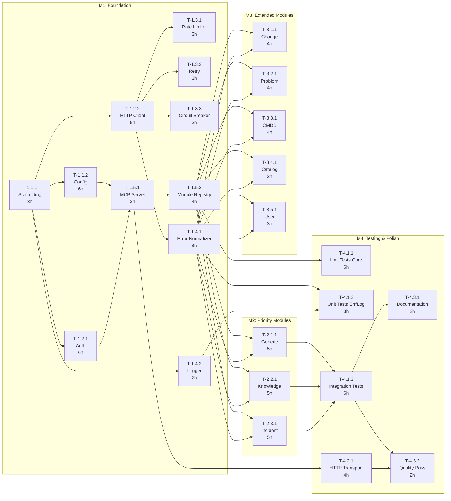

# Task Decomposition & Dependencies

## Meta

| Field | Value |
|-------|-------|
| Version | 1.0 |
| Total Milestones | 4 |
| Total Modules | 12 |
| Total Tasks | 28 |
| Parallel Groups | 6 |
| Estimated Total Tokens | ~520K |
| Estimated Total Effort | ~80 hours |

---

## Hierarchy Overview

### M1: Foundation (Project Setup + Core Infrastructure)

- **M1-MOD1**: Project Initialization
  - T-1.1.1: Project scaffolding (package.json, tsconfig, vitest) — 3h — 12K tokens — Sonnet
  - T-1.1.2: Configuration system (schema, loader, defaults) — 6h — 30K tokens — Sonnet

- **M1-MOD2**: ServiceNow Client
  - T-1.2.1: Auth strategies (Basic, OAuth, Token) — 6h — 35K tokens — Sonnet
  - T-1.2.2: HTTP client (URL construction, query params, fetch) — 5h — 28K tokens — Sonnet

- **M1-MOD3**: Resilience Layer
  - T-1.3.1: Rate limiter (token bucket) — 3h — 18K tokens — Sonnet
  - T-1.3.2: Retry handler (exponential backoff + jitter) — 3h — 18K tokens — Sonnet
  - T-1.3.3: Circuit breaker (optional, config-gated) — 3h — 18K tokens — Sonnet

- **M1-MOD4**: Error Handling & Logging
  - T-1.4.1: Error normalizer (HTTP → MCP error codes) — 4h — 22K tokens — Sonnet
  - T-1.4.2: Pino logger setup (stderr, child loggers, correlation IDs) — 2h — 12K tokens — Haiku

- **M1-MOD5**: MCP Server Core
  - T-1.5.1: MCP server setup + stdio transport — 3h — 18K tokens — Sonnet
  - T-1.5.2: Module registry + feature flag gating — 4h — 25K tokens — Sonnet

### M2: Priority Modules (Knowledge Base + Generic + Incident)

- **M2-MOD1**: Generic Module
  - T-2.1.1: Generic module (query_records, get_record + write tools) — 5h — 30K tokens — Sonnet

- **M2-MOD2**: Knowledge Base Module (Priority 1)
  - T-2.2.1: Knowledge module (search, get + write tools) — 5h — 30K tokens — Sonnet

- **M2-MOD3**: Incident Module
  - T-2.3.1: Incident module (list, get + write tools) — 5h — 30K tokens — Sonnet

### M3: Extended Modules (Change, Problem, CMDB, Catalog, User)

- **M3-MOD1**: Change Module
  - T-3.1.1: Change module implementation — 4h — 25K tokens — Sonnet

- **M3-MOD2**: Problem Module
  - T-3.2.1: Problem module implementation — 4h — 25K tokens — Sonnet

- **M3-MOD3**: CMDB Module
  - T-3.3.1: CMDB module (query_cis, get_ci, relationships + write tools) — 4h — 25K tokens — Sonnet

- **M3-MOD4**: Catalog Module
  - T-3.4.1: Catalog module implementation — 3h — 20K tokens — Sonnet

- **M3-MOD5**: User Module
  - T-3.5.1: User module (read-only: search, get, groups, members) — 3h — 18K tokens — Haiku

### M4: Integration, Testing & Polish

- **M4-MOD1**: Integration Testing
  - T-4.1.1: Unit tests for config, auth, client, resilience — 6h — 35K tokens — Sonnet
  - T-4.1.2: Unit tests for error handling and logging — 3h — 18K tokens — Haiku
  - T-4.1.3: Integration tests for MCP server + modules (mock ServiceNow) — 6h — 40K tokens — Sonnet

- **M4-MOD2**: HTTP Transport (Optional)
  - T-4.2.1: Streamable HTTP transport with Express.js — 4h — 25K tokens — Sonnet

- **M4-MOD3**: Documentation & Polish
  - T-4.3.1: README, .env.example, configuration documentation — 2h — 12K tokens — Haiku
  - T-4.3.2: Final quality pass (lint, type-check, coverage check) — 2h — 10K tokens — Haiku

---

## Task Detail Table

| Task ID | Task Name | Deps | PG | Effort | Tokens | Model | AC Mapping |
|---------|-----------|------|-----|--------|--------|-------|------------|
| T-1.1.1 | Project scaffolding | None | PG-1 | 3h | 12K | Sonnet | — |
| T-1.1.2 | Configuration system | T-1.1.1 | — | 6h | 30K | Sonnet | AC-015, AC-016 |
| T-1.2.1 | Auth strategies | T-1.1.1 | PG-2 | 6h | 35K | Sonnet | AC-001, AC-009, AC-014 |
| T-1.2.2 | HTTP client | T-1.1.1 | PG-2 | 5h | 28K | Sonnet | AC-007 |
| T-1.3.1 | Rate limiter | T-1.2.2 | PG-3 | 3h | 18K | Sonnet | AC-018 |
| T-1.3.2 | Retry handler | T-1.2.2 | PG-3 | 3h | 18K | Sonnet | AC-013 |
| T-1.3.3 | Circuit breaker | T-1.2.2 | PG-3 | 3h | 18K | Sonnet | AC-017 |
| T-1.4.1 | Error normalizer | T-1.2.2 | PG-3 | 4h | 22K | Sonnet | AC-009–AC-012, AC-020 |
| T-1.4.2 | Logger setup | T-1.1.1 | PG-2 | 2h | 12K | Haiku | AC-019 |
| T-1.5.1 | MCP server + stdio | T-1.1.2, T-1.2.1 | — | 3h | 18K | Sonnet | AC-001 |
| T-1.5.2 | Module registry | T-1.5.1 | — | 4h | 25K | Sonnet | AC-002, AC-003, AC-008 |
| T-2.1.1 | Generic module | T-1.5.2, T-1.4.1 | PG-4 | 5h | 30K | Sonnet | AC-007, AC-008 |
| T-2.2.1 | Knowledge module | T-1.5.2, T-1.4.1 | PG-4 | 5h | 30K | Sonnet | AC-002–AC-005 |
| T-2.3.1 | Incident module | T-1.5.2, T-1.4.1 | PG-4 | 5h | 30K | Sonnet | AC-006 |
| T-3.1.1 | Change module | T-1.5.2, T-1.4.1 | PG-5 | 4h | 25K | Sonnet | — |
| T-3.2.1 | Problem module | T-1.5.2, T-1.4.1 | PG-5 | 4h | 25K | Sonnet | — |
| T-3.3.1 | CMDB module | T-1.5.2, T-1.4.1 | PG-5 | 4h | 25K | Sonnet | — |
| T-3.4.1 | Catalog module | T-1.5.2, T-1.4.1 | PG-5 | 3h | 20K | Sonnet | — |
| T-3.5.1 | User module | T-1.5.2, T-1.4.1 | PG-5 | 3h | 18K | Haiku | — |
| T-4.1.1 | Unit tests (core) | T-1.5.2 | PG-6 | 6h | 35K | Sonnet | AC-009–AC-016, AC-018–AC-020 |
| T-4.1.2 | Unit tests (errors+logs) | T-1.4.1, T-1.4.2 | PG-6 | 3h | 18K | Haiku | AC-019 |
| T-4.1.3 | Integration tests | T-2.1.1, T-2.2.1, T-2.3.1 | — | 6h | 40K | Sonnet | AC-001–AC-012 |
| T-4.2.1 | HTTP transport | T-1.5.1 | — | 4h | 25K | Sonnet | — |
| T-4.3.1 | Documentation | T-4.1.3 | — | 2h | 12K | Haiku | — |
| T-4.3.2 | Quality pass | T-4.1.3, T-4.2.1 | — | 2h | 10K | Haiku | — |

---

## Dependency Graph



---

## Critical Path

The **critical path** (longest sequence of dependent tasks) determines the minimum project duration:

```
T-1.1.1 (3h) → T-1.1.2 (6h) → T-1.5.1 (3h) → T-1.5.2 (4h) → T-2.2.1 (5h) → T-4.1.3 (6h) → T-4.3.2 (2h)
```

**Critical path duration: ~29 hours** (with parallelization, actual elapsed time is significantly less)

---

## Parallel Groups

| Group | Tasks | Prerequisite | Duration (longest) |
|-------|-------|-------------|-------------------|
| PG-1 | T-1.1.1 | None | 3h |
| PG-2 | T-1.2.1, T-1.2.2, T-1.4.2 | T-1.1.1 | 6h |
| PG-3 | T-1.3.1, T-1.3.2, T-1.3.3, T-1.4.1 | T-1.2.2 | 4h |
| PG-4 | T-2.1.1, T-2.2.1, T-2.3.1 | T-1.5.2 + T-1.4.1 | 5h |
| PG-5 | T-3.1.1, T-3.2.1, T-3.3.1, T-3.4.1, T-3.5.1 | T-1.5.2 + T-1.4.1 | 4h |
| PG-6 | T-4.1.1, T-4.1.2 | T-1.5.2 + T-1.4.1/T-1.4.2 | 6h |

---

## Token Budget Summary

### By Milestone

| Milestone | Tasks | Total Tokens | +15% Buffer | Cost Estimate |
|-----------|-------|-------------|-------------|---------------|
| M1: Foundation | 11 | 236K | 271K | ~$4.10 |
| M2: Priority Modules | 3 | 90K | 104K | ~$1.56 |
| M3: Extended Modules | 5 | 113K | 130K | ~$1.95 |
| M4: Testing & Polish | 6 | 140K | 161K | ~$2.42 |
| **Total** | **25** | **579K** | **666K** | **~$10.03** |

*Cost estimates based on Sonnet 4.5 pricing (~$15/1M tokens average)*

### By Model

| Model | Task Count | Total Tokens | Est. Cost |
|-------|-----------|-------------|-----------|
| Haiku | 6 | 82K | ~$0.25 |
| Sonnet | 19 | 497K | ~$7.46 |
| Opus | 0 | 0K | $0.00 |
| **Total** | **25** | **579K** | **~$7.71** |

### Session Planning

- **Sonnet 4.5 usable budget per session**: ~800K tokens
- **Total project tokens**: ~666K (with buffer)
- **Recommended**: **1 session** (fits within budget; start new session only if context pressure detected)
- **Cost-optimization**: Run Haiku tasks (T-1.4.2, T-3.5.1, T-4.1.2, T-4.3.1, T-4.3.2) in batch to save ~30%
